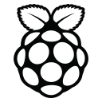

    
     
      
      
        
         
    
    

        <em>
            Web dev teacher at <a href="https://fenelon-notredame.com">Lycée Fénelon Notre Dame    </a> Developer Consultant at <a href="https://www.liliwol.fr">LiliwoL   </a> 
        </em>
    

      
    

    

        <a href="#vuejs">&nbsp;</a>
        <a href="#python">&nbsp;</a>
        <a href="#raspberry">&nbsp;</a>
        <a href="#docker">&nbsp;</a>
        <a href="#symfony">&nbsp;</a>
        <a href="#javascript">&nbsp;</a>
    

      
    

    <h2 id="vuejs">
        Projets utilisant Vue:
         
        <a href="https://github.com/LiliwoL/Vue-Cours-Metaux-Precieux">Cours des métaux précieux</a>
         
        <a href="https://github.com/LiliwoL/Vue-Raspberry-Domotique-Prises-Connectees">Frontend pour un projet Raspberry Pi de prises connectées</a>
         
        <a href="https://github.com/LiliwoL/Vue-Frontend-API-Gestion-Stages-Etudiants">Frontend API Gestion de stages des étudiants - BTS SIO</a>
    </h2>
      
    

    <h2 id="python">
        Projets utilisant Python:
         
        <a href="https://github.com/LiliwoL/Python-Raspberry-Domotique-Prises-Connectees">Backend pour un projet Raspberry Pi de prises connectées</a>
         
        <a href="https://github.com/LiliwoL/Python-socket">Programmation Socket</a>        
    </h2>
      
    

    <h2 id="raspberry">
        Projets pour les Raspberry Pi:
         
        <a href="https://github.com/LiliwoL/Python-Raspberry-Domotique-Prises-Connectees">Backend pour un projet Raspberry Pi de prises connectées</a>        
         
        <a href="https://github.com/LiliwoL/Vue-Raspberry-Domotique-Prises-Connectees">Frontend pour un projet Raspberry Pi de prises connectées</a>
    </h2>
      
    

    <h2 id="docker">
        Projets pour Docker:
         
        <a href="https://github.com/LiliwoL/Docker-MongoDB">Docker Mongo et Mongo Express</a>
    </h2>
      
    

    <h2 id="symfony">
        Projets pour Symfony:
         
        <a href="https://github.com/LiliwoL/Symfony-API-Gestion-Stages-Etudiants">API Gestion de stages - BTS SIO</a>
         
        <a href="https://github.com/LiliwoL/Symfony-Sortir-dot-com">Sortir.com - BTS SIO</a>
         
        <a href="https://github.com/LiliwoL/Symfony-Cine">SymfonyCine - BTS SIO</a>
    </h2>
      
    

    <h2 id="javascript">
        Projets Javascript:
         
        <a href="https://github.com/LiliwoL/Javascript-Super-Simon">Jeu Super Simon</a>
         
        <a href="https://github.com/LiliwoL/Javascript-Memory-Game">Jeu Memory (2 versions)</a>
    </h2>

